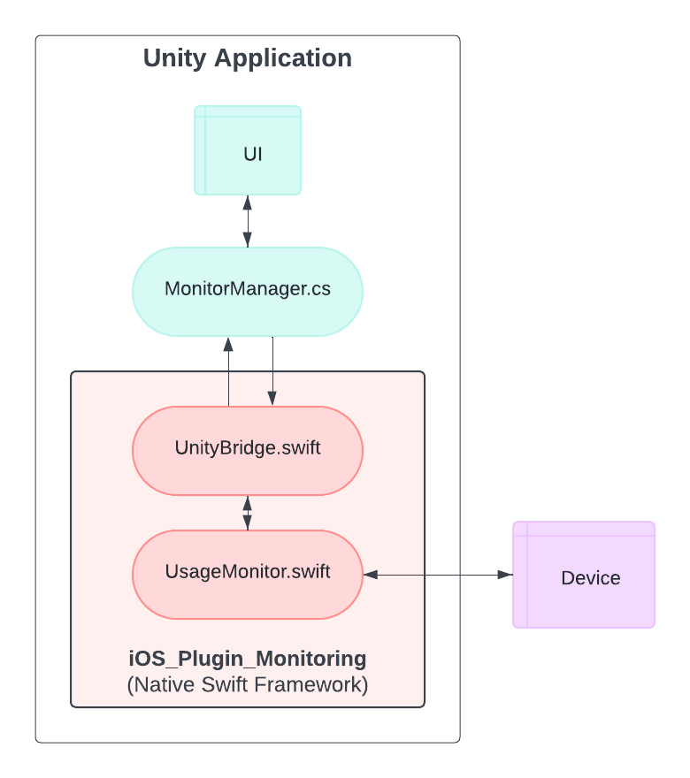

# iOSNativePluginUnity
A prototype Unity application to track the RAM usage of an iOS device.

The code is documented, so you shouldn't have any problem understanding it. 

## How it works
- When you press "Start Monitoring" the application will start a background timer
- Every second, it will fetch the current RAM usage by the process
- When you press "Stop Monitoring" it will calculate the average usage during that timeframe
- The result will be displayed in the UI

## Application architecture
The application consists of a main Unity build and an embeded native iOS Swift Framework.

## To-Do
- [x] Unity UI
- [x] Unity - Swift bridge
- [x] RAM Monitoring
- [ ] CPU
- [ ] GPU

## Known issues
For some reason I couldn't find the cause yet, it's not working properly in the iOS simulator